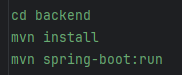
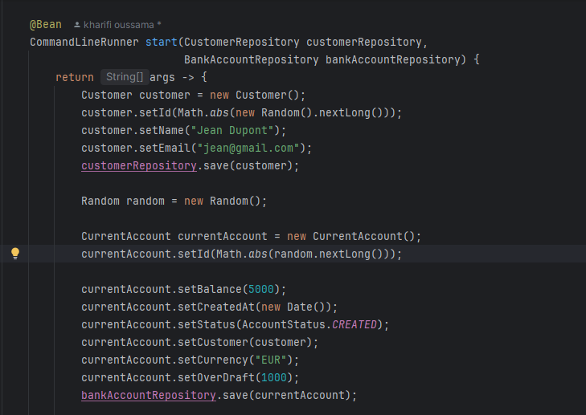
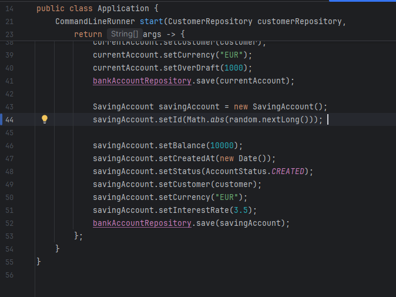

# Banking App - Spring Boot & Angular

## Description
Cette application bancaire permet aux utilisateurs de gérer leurs comptes, consulter l’historique des transactions et effectuer des virements de manière sécurisée grâce à l’authentification JWT.  
Le backend est construit avec Spring Boot, et le frontend est développé avec Angular.

## Fonctionnalités
- Authentification sécurisée avec JWT
- Création et gestion des comptes bancaires
- Consultation de l'historique des transactions
- Effectuer des virements entre comptes
- Interface utilisateur moderne avec Angular Material
- API REST sécurisée avec Spring Security

## Technologies utilisées
- **Backend** : Java 21, Spring Boot 3.4.5, Spring Security, Hibernate, H2 Database
- **Frontend** : Angular 17, Angular Material
- **Sécurité** : JSON Web Token (JWT)
- **Build Tools** : Maven

## Installation et Lancement

### Backend (Spring Boot)

## Réponses aux étapes du projet

### 1. Créer un projet Spring Boot
Le projet a été créé avec **Spring Initializr**, avec les dépendances suivantes :
- Spring Web
- Spring Data JPA
- Spring Security
- H2 Database
- Lombok

### 2. Créer les entités JPA
Les entités suivantes ont été créées :
- **Customer** : représente un client bancaire.
- **BankAccount** (classe abstraite) : représente un compte bancaire générique.
- **CurrentAccount** : hérite de `BankAccount` et ajoute la notion de découvert autorisé.
- **SavingAccount** : hérite de `BankAccount` et ajoute la notion de taux d’intérêt.
- **AccountOperation** : représente une opération bancaire (crédit ou débit).

### 3. Créer les interfaces JPA Repository
Utilisation de **Spring Data JPA** pour la persistance des données avec les interfaces :
- `CustomerRepository`
- `BankAccountRepository`
- `AccountOperationRepository`

Chaque interface étend `JpaRepository`, ce qui permet de bénéficier automatiquement des opérations CRUD.

### 4. Tester la couche DAO
La couche DAO a été testée en :
- Créant des clients et des comptes bancaires.
- Enregistrant des opérations de crédit et débit sur les comptes.
- Utilisant `CommandLineRunner` pour insérer des données de test au démarrage de l'application.

